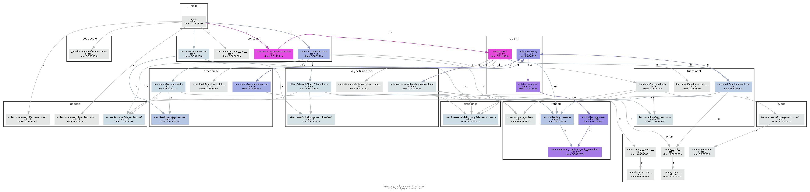
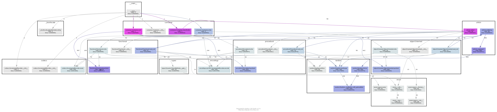
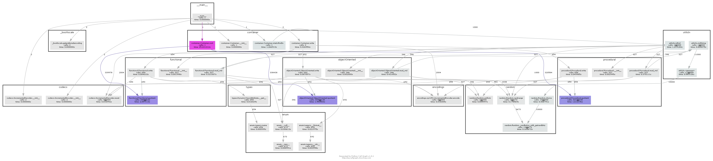
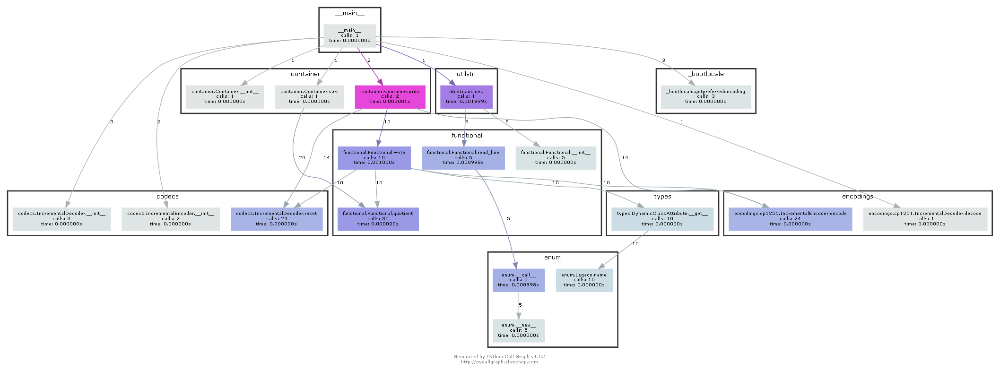
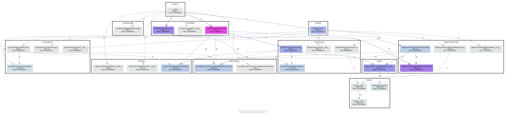

# Третье Домашнее задание "Архитектура вычислительных систем"

## Задача: Языки программирования, Вариант 148 (8, 11)

### Автор: Туракулов Исломбек Улугбекович

## Условие задачи

> Общие для всех альтернатив переменные
> * Популярность в процентах (TIOBI) — действительное
> * Год создания — целое

------

### Общие для всех альтернатив функции

Частное от деления года создания на количество символов в названии (действительное число)
---------

### Базовые альтернативы

> _Процедурные_
>> * наличие, отсутствие абстрактных типов данных – булевская величина

> _Объектно-ориентированные_
>> * наследование: одинарное, множественное, интерфейса – перечислимый тип

> _Функциональные_
>> * типизация – перечислимый тип = строгая, динамическая
>> * поддержка «ленивых» вычислений – булевский тип

### Функционал

_После размещения данных в контейнер необходимо осуществить их обработку в соответствии с вариантом задания.
Обработанные данные после этого заносятся в отдельныӗ файл результатов._

Упорядочить элементы контейнера по возрастанию используя сортировку Сортировка с помощью прямого выбора (Straight
Selection). В качестве ключей для сортировки и других действий используются результаты функции, общей для всех
альтернатив.

---------

## Сборка полученной программы.

```
python <name>.py
python3 <name>.py

python -f <input_file> <outputfile1> <outputfile2>
python -n <numbers> <outputfile1> <outputfile2>
```

Исполняемый файл программы будет расположен в папке `venv`.

---

## Тестирование

Исходные данные для тестирования содержатся в каталоге `reports`.

Файл с результатами прогонов тестов `reports/report_files.txt`, `reports/report_random.txt` .

Примеры использования программы без тестирующего скрипта. Предполагается, что сейчас мы в корне проекта. Использовался
компилятор GCC в ОС Linux

```
# Parse input file with data
./ACS-HW-3/main.py -f tests/mixed.txt outs/mixed.out.txt outs/mixed_sorted.txt
# Parse input file with random generator setup for the test
./ACS-HW-3/main.py -n 100 outs/out100.txt outs/out100_sorted.out.txt
```
## Процедурная (C++)

Время работы программы на разных размерах входных данных:

Количество языков программирования | Время работы, seconds | Потребляемая память, KB 
--- | --- | --- 
`7` | < `0.002` | `~2750`
`100` | < `0.01` | `~2892` 
`1000` | `0.01` | `~3674`
`5000` | `0.15` | `~4622`
`10000` | `0.96` | `~4877`


## Объектно-ориентированная (C++)

Время работы программы на разных размерах входных данных:

Количество языков программирования | Время работы, seconds | Потребляемая память, KB 
--- | --- | --- 
`7` | < `0.001` | `~2600`
`100` | < `0.01` | `~2800` 
`1000` | `0.01` | `~3500`
`5000` | `0.14` | `~4150`
`10000` | `0.90` | `~4625`

## Динамическая типизация (Python)
Время работы программы на разных размерах входных данных:

Количество языков программирования | Время работы, seconds | Потребляемая память, KB 
--- | --- | --- 
`10` | `Source: 0.002 Sort: 0.002` | `~4420`
`100` | `Source: 0.005 Sort: 0.023` | `~5650`
`1000` | `Source: 0.038 Sort: 1.911` | `~8652`
`5000` | `Source: 0.069 Sort: 2.233` | `~10841`
`10000` | `Source: 0.423 Sort: 169.316` | `~20532`

---
## Разница процедурной, объектно-ориентированной реализацией между динамической типизацией

--------
Динамический тип дает больше свободы, однако вы потратите за это довольно высокую цену: во-первых, программа становится довольно медленной, во-вторых, гораздо сложнее отлавливать ошибки.
Потребление времени, и памяти стремится O(N<sup>2</sup>) - след-но он гораздо медленнее, однако легче в использовании (чтение и запись)

## Метрики, определяющие характеристики программы:

| Метрика | Значение |
| :---: | --- |
| Число модулей с реализацией | 6 + 1 (дополнительные методы для рандомизации) |
| Общий размер исходных текстов программы | 20.211 KB |
| Размер исполняемого файла релизной сборки (GCC, Linux)__*__ | 37.012 KB |

__*__ Версии подробнее:

```
$ g++ --version
g++ (Ubuntu 9.3.0-17ubuntu1~20.04) 9.3.0
Copyright (C) 2019 Free Software Foundation, Inc.
This is free software; see the source for copying conditions.  There is NO
warranty; not even for MERCHANTABILITY or FITNESS FOR A PARTICULAR PURPOSE.

$ lsb_release -a
Distributor ID: Ubuntu
Description:    Ubuntu 20.04.2 LTS
Release:        20.04
Codename:       focal

$ uname -a
Linux DESKTOP-250N7G3 5.10.16.3-microsoft-standard-WSL2 #1 SMP Fri Apr 2 22:23:49 UTC 2021 x86_64 x86_64 x86_64 GNU/Linux
```

## Описание структуры вычислительной системы:


--------------------------

Я решил воспользоваться графическим представлением использования памяти проекта. Я заранее подготовил схему работы программы в разных входных файлах, сами фотографии отчёта находятся в папке `./ACS-HW-3/reports/`:

### Рандомизация 10 элементов, 
Выходные данные находятся [здесь](./outs/out10.txt), отсортированные данные [здесь](./outs/out10_sorted.txt)



### Рандомизация 50 элементов, 
Выходные данные находятся [здесь](./outs/out50.txt), отсортированные данные [здесь](./outs/out50_sorted.txt)




### Рандомизация 1000 элементов, 
Выходные данные находятся [здесь](./outs/out1000.txt), отсортированные данные [здесь](./outs/out1000_sorted.txt)



### Составление графика потребления памяти входным файлом
Использовал входной файл `functional.txt` в папке `./tests/`.
Выходные данные находятся [здесь](./outs/functional.out.txt), отсортированные данные [здесь](./outs/functional_sorted.txt)



Использовал входной файл `mixed.txt` в папке `./tests/`.
Выходные данные находятся [здесь](./outs/mixed.out.txt), отсортированные данные [здесь](./outs/mixed_sorted.txt)


